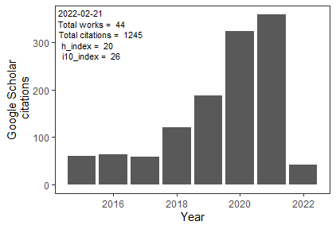

Dr Nicholas J Clark
===================

Postdoctoral Fellow - University of Queensland, School of Veterinary Science
Gatton, Queensland, Australia - <nicholas.j.clark1214@gmail.com> - 0432420979
[Homepage](http://nicholasjclark.weebly.com/) - [GitHub](https://github.com/nicholasjclark) - [Google Scholar](https://scholar.google.com.au/citations?hl=en&user=5bO9uxEAAAAJ&view_op=list_works&gmla=AJsN-F7bdYY9zcTVOHPEOVWZOJmCtgWpcxs_93x6Nxu1saXGdZjQLZ9byuM7Bdln9uk-HvNvAG1pThmdF6m_XgubeW0Q2sVTsjvpgou00G94hSHvb99iNTk) - [ResearchGate](https://www.researchgate.net/profile/Nicholas_Clark4)

Career Summary
--------------

Flexible and engaging ecologist within interests in studying how pathogen communities assemble, persist and function. Interested in developing computational phylogenetic tools and adapting techniques from statistical network theory to study how parasites interact with their hosts across urban-wildlife gradients.

Transferable Skills
-------------------

-   Strong communication skills: 19 publications in peer-reviewed journals; four presentations at international conferences
-   Broad field experience: supervised teams of field researchers in both terrestrial and marine habitats
-   Extensive experience using script-based programming: proficient with frequentist and probabilistic statistical analyses; maintain two `R` packages for community ecology and landscape genetics research
-   Aptitude for leadership: trained four postgraduate students in bioinformatics and statistical techniques
-   Proven ability to obtain funding: $52000 external funding from domestic and international organisations

Qualifications
--------------

**PhD**
**Griffith University** (Supervisors: Dr Sonya Clegg, Dr Robert Adlard, Prof. Hamish McCallum)
Thesis: *The distribution and diversity of avian malaria parasites in Australian and Southern Melanesian birds*

-   Led field expeditions in diverse habitats on four islands in New Caledonia and across two Australian states
-   Acquired extensive experience coding biogeographical analyses on large datasets using frequentist and Bayesian techniques
-   Published ten peer-reviewed papers over four years, including six published chapters by submission of the thesis

**GDipResMeth**
**James Cook University** (Supervisors: Prof Garry Russ, Dr Lynne van Herwerden) Thesis: *Connectivity of butterflyfishes: pairing molecular methods and field observations*

-   Lead volunteer divers on two field trips to conduct marine abundance and habitat complexity surveys
-   Developed laboratory skills to conduct high-throughput genetic analyses
-   Obtained a high distinction in a Sampling and Experimental Design course and developed key programming skills to perform ecological statistical analyses

**BSc (honours)**
**University of North Carolina at Wilmington**; North Carolina, USA

-   Dean’s list for academic achievement in all semesters (GPA 4.0/4.0)

Professional Experience
-----------------------

**Postdoctoral Fellow (7/2016 - 12/18)**
**University of Queensland**, School of Veterinary Science

-   Co-supervising two PhD students in disease ecology and quantitative genetics
-   Conducting research into the spatio-temporal evolution of canine parvoviruses
-   Leading a National Geographic-funded project on the spread of parasites at the human-wildlife interface

**Research Assistant (1/2016 - 7/16)**
**University of Queensland**, School of Veterinary Science (Adviser: Dr Steven Kopp)

-   Conducted molecular research into population genetics of canine hookworm
-   Established protocols to develop next generation sequencing tools for cat fleas

**Technical Laboratory Officer (fill-in for maternity leave; 9/2015 - 11/15)**
**Biosecurity Laboratory**, Queensland Dept. Agriculture and Fisheries (Adviser: Dr Les Barker)

-   Improved workflow efficiency by preparing reagents for three diagnostic laboratories
-   Cultured in-house microbe strains and carried out quality control testing

Summary Citation Metrics
------------------------

Full Publication List
---------------------

**2018**

**Clark, NJ**, Wells, K, and Lindberg, O. Unravelling changing interspecific interactions across environmental gradients using Markov random fields. *Ecology* (accepted 02/03/18)

**Clark, NJ**. Phylogenetic uniqueness, not latitude, explains the diversity of avian blood parasite communities worldwide. *Global Ecology and Biogeography* (accepted 27/02/18)

Wells, L, Gibson, DI, **Clark, NJ**, Ribas, A, Morand, S, McCallum, H. Global spread of helminth parasites at the human – domestic animal – wildlife interface. (2018). *Global Change Biology* DOI: 10.1111/gcb.14064. [PDF](http://nicholasjclark.weebly.com/uploads/4/4/9/4/44946407/wells_etal_2018_globchangbiol.pdf)

**Clark, NJ**, Seddon, JM, Kyaw‐Tanner, M, Al-Alawneh, J, Harper, G, McDonagh, P, and Meers, J. Emergence of canine parvovirus subtype 2b (CPV-2b) infections in Australian dogs. *Infection, Genetics and Evolution* DOI: 10.1016/j.meegid.2017.12.013. [PDF](http://nicholasjclark.weebly.com/uploads/4/4/9/4/44946407/clark_infgenevol_2018.pdf)

**Clark, NJ**, Seddon, JM, Šlapeta, J, and Wells, K. Parasite spread at the domestic animal - wildlife interface: anthropogenic habitat use, phylogeny and body mass drive risk of cat and dog flea (Ctenocephalides spp.) infestation in wild mammals. *Parasites & Vectors* DOI: 10.1186/s13071-017-2564-z. [PDF](http://nicholasjclark.weebly.com/uploads/4/4/9/4/44946407/clark_etal_2018parvec.pdf)

**2017**

**Clark, NJ**, Clegg, SM, Sam, K, Goulding, W, Koane, B and Wells, K. Climate, host phylogeny and the connectivity of host communities govern regional parasite assembly. *Diversity and Distributions* DOI: 10.1111/ddi.12661. [PDF](http://nicholasjclark.weebly.com/uploads/4/4/9/4/44946407/clark_et_al-2017-diversity_and_distributions.pdf)

**Clark, NJ** and Clegg, SM (2017) Integrating phylogenetic and ecological distances reveals new insights into parasite host specificity. *Molecular Ecology* 26(11), 3074-3086. [PDF](http://nicholasjclark.weebly.com/uploads/4/4/9/4/44946407/clark_and_clegg-2017-molecular_ecology.pdf)

McKee, J, **Clark, NJ**, Shapter, F and Simmons, G. (2017) A new look at the origins of Gibbon Ape Leukemia Virus. *Virus Genes* 53(2), 165-172. [PDF](http://nicholasjclark.weebly.com/uploads/4/4/9/4/44946407/mckee_et_al._2017_virus_genes.pdf)

**2016**

**Clark, NJ**, Wells, K, Dimitrov, D and Clegg, SM. (2016) Co-infections and environmental conditions drive the distributions of blood parasites in wild birds. *Journal of Animal Ecology* 85(6), 1461-1470. [PDF](http://nicholasjclark.weebly.com/uploads/4/4/9/4/44946407/clark_et_al-2016-journal_of_animal_ecology.pdf)

Aharon-Rotman, Y, Buchanan, KL, **Clark, NJ**, Klaassen, M and Buttemer, WA. (2016) Why fly the extra mile? Using stress biomarkers to assess wintering habitat quality in migratory shorebirds. *Oecologia* 182(2), 385-395. [PDF](http://nicholasjclark.weebly.com/uploads/4/4/9/4/44946407/aharon-rotmanetal.2016whyflyextramile.pdf)

Goulding, W, Adlard, RD, Clegg, SM and **Clark, NJ**. (2016) Molecular and morphological description of *Haemoproteus* (*Parahaemoproteus*) *bukaka* (species nova), a haemosporidian associated with the strictly Australo-Papuan host Subfamily Cracticinae. *Parasitology Research* 115, 3387-3400.[PDF](http://nicholasjclark.weebly.com/uploads/4/4/9/4/44946407/goulding_et_al_parasres2016.pdf)

**Clark, NJ**, Clegg, SM and Klaassen, M. (2016) Migration strategy and pathogen risk: non‐breeding distribution drives malaria prevalence in migratory waders. *Oikos* 125(9), 1358-1368. [PDF](http://nicholasjclark.weebly.com/uploads/4/4/9/4/44946407/clark_et_al-oikos_2016.pdf)

**2015**

**Clark, NJ**, Ishtiaq, F, Olsson-Pons, S and Clegg, SM. (2015) Specialist enemies, generalist weapons and the potential spread of exotic pathogens: malaria parasites in a highly invasive bird. *International Journal for Parasitology* 45(14), 891-899. [PDF](http://nicholasjclark.weebly.com/uploads/4/4/9/4/44946407/clark_et_al_ijp_2015_mynas.pdf)

Olsson-Pons, S, **Clark, NJ**, Ishtiaq, F and Clegg, SM. (2015) Differences in host species relationships and biogeographical influences produce contrasting patterns of prevalence, community composition and genetic structure in two genera of avian malaria parasites in southern Melanesia. *Journal of Animal Ecology* 84(4), 985-998. [PDF](https://nicholasjclark.weebly.com/uploads/4/4/9/4/44946407/olsson-pons_et_al-2015-journal_of_animal_ecology.pdf)

**Clark, NJ**, Adlard, RD and Clegg, SM. (2015) Molecular and morphological characterization of *Haemoproteus* (*Parahaemoproteus*) *ptilotis*, a parasite infecting Australian honeyeaters (Meliphagidae), with remarks on prevalence and potential cryptic speciation. *Parasitology Research* 114(5), 1921-1928. [PDF](http://nicholasjclark.weebly.com/uploads/4/4/9/4/44946407/clark_et_al_paras_res_2015.pdf)

**Clark, NJ** and Clegg, SM. (2015) The influence of vagrant hosts and weather patterns on the colonisation and persistence of blood parasites in an island bird. *Journal of Biogeography* 42(4), 641-651. [PDF](http://nicholasjclark.weebly.com/uploads/4/4/9/4/44946407/clark_and_cleggjbi_proofs.pdf)

**2014**

**Clark, NJ**, Adlard, RD and Clegg, SM. (2014) First evidence of avian malaria in Capricorn Silvereyes (*Zosterops lateralis chlorocephalus*) on Heron Island. *The Sunbird* 44, 1-11 [PDF](http://nicholasjclark.weebly.com/uploads/4/4/9/4/44946407/sunbird_44_1__avian_malaria_author_copy.pdf)

**Clark, NJ**, Clegg, SM and Lima, MR. (2014) A review of global diversity in avian haemosporidians (Plasmodium and Haemoproteus: Haemosporida): new insights from molecular data. *International Journal for Parasitology* 44(5), 329-338 [PDF](http://nicholasjclark.weebly.com/uploads/4/4/9/4/44946407/clark_et_al_ijp_2014_published_version.pdf)

**2012**

**Clark, NJ** and Russ, GR. (2012) Ontogenetic shifts in the habitat associations of butterflyfishes (F. Chaetodontidae). *Environmental Biology of Fishes* 94, 579-590

Publications in Review
----------------------

**Clark, NJ** and Soares Magalhães, RJ. Airborne geographical dispersal of Q Fever from livestock holdings to human communities: a systematic review and critical appraisal of evidence. *BMC Infectious Diseases* (1st submission 18/02/18)

Wells, K, Gibson, D, and **Clark, NJ**. Global patterns in helminth host specificity: phylogenetic and functional diversity of regional host species pools matter. *Ecography* (1st submission 25/01/18)

Lawrence, AL, Webb, CE, **Clark, NJ**, Halajian, A, Mihalca, A, Miret, J, D'Amico, G, Brown, G, Kumsa, B, Modry, D, and Šlapeta, J. Out-of-Africa origins and global climatic distribution of the common cat flea, Ctenocephalides felis: the hitchhiker’s guide to world domination. *Molecular Phylogenetics and Evolution* (1st submission 26/11/17)

Service and Discipline Involvement
----------------------------------

**Service**

-   Served as panel member to mark a UQ Honour’s thesis
-   Contributed to teaching and assignment design for three undergraduate courses at the School of Veterinary Science
-   Currently co-supervising two PhD students
-   Acted as student volunteer for the 2017 Australian Society for Parasitology International Conference

**Referee**

-   *Ecology Letters*
-   *Molecular Biology and Evolution*
-   *Evolutionary Ecology*
-   *Journal of Biogeography*
-   *International Journal for Parasitology*
-   *Journal of Parasitology*
-   *Journal of Animal Ecology*
-   *Infection, Genetics and Evolution*
-   *Parasitology*
-   *Malaria Journal*
-   *Parasites & Vectors*

Funding Support
---------------

**2017**

**$US18,400**: National Geographic Scientific Research Grant (co-authored the proposal). Tracing the spillover of fleas and paralysis ticks between wildlife and domestic pets in Australia

**2015**

**$AU4,975**: Birds Queensland Research Award (co-authored the proposal). The role of invasive birds as carriers of exotic pathogens; implications for co-occurring native birds

**$AU3,125**: BirdLife Australia Stuart Leslie Bird Research Award (authored the proposal). Enemy release or novel weapons: malaria’s role in the spread of the invasive Indian Myna

**2014**

**$AU2,000**: Griffith University Environmental fund for impactful publications

**2013**

**$US20,250**: National Geographic Scientific Research Grant (co-authored the proposal). Avian malaria in southern Melanesian birds

**2012**

**$AU3,750**: BirdLife Australia Stuart Leslie Bird Research Award (authored the proposal). Avian malaria lineage distribution, diversity and host specificity in southeast Queensland

**$AU5,000**: Birds Queensland Research Award (authored the proposal). The prevalence, distribution and diversity of avian malaria parasites in southeast Queensland

**$AU78,000**: Griffith University International Postgraduate Research Award

Teaching Contributions
----------------------

**2017**

**University of Queensland**, Gatton Campus: Ecological and Disease Genetics (Course Coordinator)
Undergraduate (3rd year Science), semester 1

-   Planned learning objectives; wrote the electronic course profile (ECP) and all assignments
-   Delivered flexible, interactive lectures and tutorials that were well-received by students
-   Achieved overwhelmingly positive feedback on student evaluations, including scores of ‘Outstanding’ for teacher ratings
-   SECaTs available at: VETS3042/Ecological and Disease Genetics/6720/23028

**University of Queensland**, Gatton Campus: Animal Breeding and Genetics (Course Coordinator)
Undergraduate (Bachelor of Veterinary Medicine), semester 2

-   Planned learning objectives; contributed to preparation of assignments and end of semester exam
-   Independently lead theory-based genetics tutorials
-   Nominated for a ‘Golden Speculum’ Best Lecturer award for 2017

**2016 - 17**

**University of Queensland**, Gatton Campus: Molecular and Quantitative Plant Genetics; Molecular and Quantitative Animal Genetics (Lead tutor)
Undergraduate (2nd year Science and 2nd year Agriculture), semester 2

-   Independently lead laboratory and theory tutorials
-   Marked assignments and liaised with course coordinators to enhance curriculums

**2015 - 17**

**University of Queensland**, Gatton Campus: Animal Breeding and Molecular Genetics; Animal Pathogens and Immunity; Principles of Disease (Assistant tutor)
Undergraduate (2nd year Veterinary Science), semesters 1 and 2

-   Collaborated with fellow tutors to lead laboratory and theory tutorials
-   Marked assignments

**2013**

**Griffith University**, Gold Coast Campus: Ecology; Earth Sciences (Assistant tutor)
Undergraduate (2nd year Science), semester 2

-   Independently lead laboratory and theory tutorials

Mentoring And Research Training
-------------------------------

**2017 - present**

Co-supervising UQ PhD student (A. McGowan), studying population genomics of dugongs. This student is developing novel landscape genetics analyses and recently qualified for Faculty-level heats in the UQ Three Minute Thesis competition

**2016 - present**

Co-supervising UQ PhD student (T. Proboste), studying population genomics and host-parasite interactions in paralysis ticks. This student is adapting social science methods to study host-pathogen interactions, and has already presented at two conferences

**2014 - 16**

Trained UQ PhD student (W. Goulding) in molecular techniques and aided project design, resulting in two collaborative papers (both in Parasitology Research) and one successful co-authored grant proposal (Birds Queensland; $AU4975)

**2014**

Trained Deakin University PhD student (Y. Aharon-Rotman) in Bayesian phylogenetic modelling, resulting in one collaborative paper (Oecologia)

**2012 - 13**

Trained Griffith University honour’s student (S. Olsson-Pons) in bioinformatics, resulting in two collaborative papers (Journal of Animal Ecology; International Journal for Parasitology)

Presentations and Societal Impacts
----------------------------------

**2017**

Oral presentation: Australian Society for Parasitology Conference, Leura, Australia

**2016**

Research used to frame a Question Without Notice in NSW Parliament, from Shooters and Fishers Party MP to the Minister for Primary Industries

Oral presentation: Griffith University Wildlife Disease Ecology Group, Brisbane, Australia

**2015**

Interviewed on ABC Radio National and ABC Radio Gold Coast regarding research on exotic malaria strains spread by invasive birds

Interviewed for feature stories in the Australian Society for Parasitology quarterly newsletter and in Australian Birdlife regarding research on avian malaria in Australian birds

Oral presentation: University of Queensland ARC Cavity Nesting Group, Brisbane, Australia

Oral presentation: Evolutionary Ecology of Infectious Diseases Conference, Athens, USA

Oral presentation: Griffith University Wildlife Disease Ecology Group, Brisbane, Australia

Poster presentation: Wildlife Disease Association Conference, Sunshine Coast, Australia

**2014**

Oral presentation: Queensland Ornithological Society, Brisbane, Australia

Oral presentation: Australian Society for Parasitology Concepts in Parasitology Workshop, Canberra, Australia.

Taught diagnostic techniques to students in a Parasitology High School Outreach Program at Ulladulla High School, Ulladulla, NSW, Australia

**2013**

Oral presentation: Centre for Integrative Ecology, Deakin University, Geelong, Australia

Poster presentation: Malaria and Related Haemosporidians of Wildlife International Conference, Vilnius, Lithuania

Honours and Awards
------------------

**2017**

Invited to act as co-chair for a Wildlife Parasitology session at the Australian Society for Parasitology Conference, Leura, Australia

**2016**

Research article featured on the cover and on the Editor’s Choice list at International Journal for Parasitology

**2014**

1st place oral presentation; Griffith University School of Environment Student Symposium

**2014**

Accepted for competitive placement with travel funds; Australian Society for Parasitology Concepts in Parasitology Workshop, Canberra, Australia

**2012**

2nd place oral presentation; Griffith University School of Environment Student Symposium

**2012**

Accepted for competitive placement with travel funds; Malaria RCN Student Workshop, Virginia, USA

Relative to Opportunity
-----------------------

I completed my undergraduate degree (Bachelor of Science; GPA 4.0) in 2009 and completed a Graduate Diploma by Research Methods in 2011 (High Distinction average). I began my PhD in February 2012 and finished in April 2016, delivering a thesis with six published chapters and two published appendices. My PhD work provided new insights into mechanisms driving the distributions of blood parasites in wild birds. I also gained a broad understanding of coexistence theory and its applications to community ecology, for instance by providing evidence that interspecific parasite interactions can influence infection rates.

Following my PhD I have devoted much of my postdoctoral work to teaching and mentoring postgraduate research students. This has provided me with a set of leadership and organizational skills that I believe is unique among my peers. It also taught me to be proficient with the time that I do have available for research. Since winding down teaching in July last year, I have published seven papers and submitted another three, bringing my total to 19 publications. The quality and significance of this work is reflected by my exemplary publication record in some of the top journals in Ecology and Biogeography. My research has also garnered international recognition. I was invited to present work on new statistical tools for studying parasite niche differentiation at the Australian Society for Parasitology’s 2017 International Conference, where I was also invited to act as co-chair for a wildlife parasitology session. Recently, I have been invited to act as guest editor for a [*Tropical Medicine and Infectious Disease* Special Issue](http://www.mdpi.com/journal/tropicalmed/special_issues/Medical_Geography) on disease patterns in a changing environment.

Referees
--------

-   A/Prof Jennifer Seddon, UQ Gatton Campus; <j.seddon1@uq.edu.au>
-   Dr Robert Adlard, Queensland Museum; <robert.adlard@qm.qld.gov.au>
-   Dr Sonya Clegg, Oxford University; <sonya.clegg@zoo.ox.ac.uk>
-   Prof Marcel Klaassen, Deakin University; <marcel.klaassen@deakin.edu.au>
